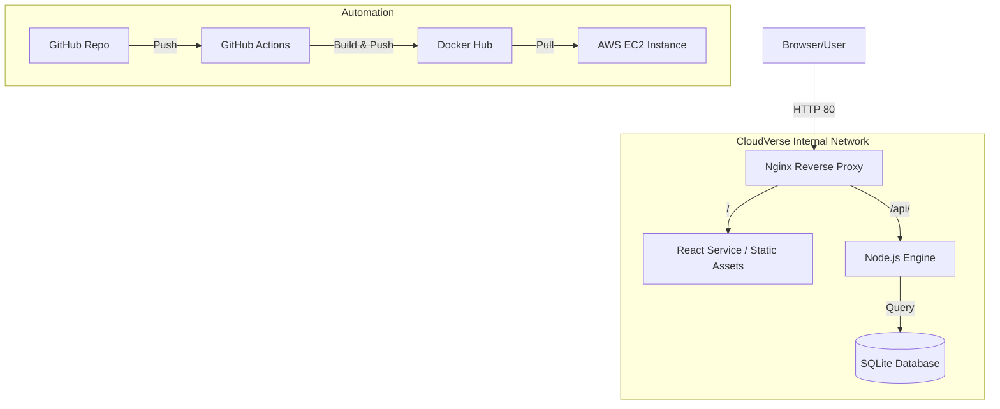

# 🌐 CloudVerse: Professional Cloud Infrastructure Simulator

CloudVerse is a production-ready dashboard for monitoring and managing mock cloud deployments. It features a modern React frontend, a persistent Node.js/SQLite backend, and is fully containerized with an Nginx reverse proxy.

## 🏗️ Architecture Overview



## 🚀 Key Features

- **Premium UI**: Glassmorphism aesthetic with real-time progress animations.
- **Persistence**: SQLite integration for tracking deployment history.
- **DevOps Ready**: Nginx reverse proxy with automated Docker Hub propagation via GitHub Actions.
- **Structured Logging**: Winston-powered logging for backend audit trails.
- **Infrastructure Architecture**: Fully containerized multi-container architecture.

## 🛠️ Local Setup

1. **Clone the repository**:
   ```bash
   git clone https://github.com/your-username/CloudVerse.git
   cd CloudVerse
   ```

2. **Run with Docker Compose**:
   ```bash
   docker-compose up --build
   ```

3. **Access the application**:
   - Dashboard: `http://localhost`
   - Health Check: `http://localhost/api/health`

## ☁️ Deployment on AWS EC2

1. **Provision EC2 Instance**: (Ubuntu 22.04 LTS recommended). 
2. **Install Docker & Docker Compose**:
   ```bash
   sudo apt update && sudo apt install -y docker.io docker-compose
   sudo usermod -aG docker $USER && newgrp docker
   ```
3. **Deploy the Stack**:
   - Clone the repo on the instance and run `docker-compose up -d`.
   - Ensure Security Groups allow inbound traffic on Port 80.

## 📦 Tech Stack

- **Frontend**: React 19, Tailwind CSS, Lucide Icons.
- **Backend**: Node.js, Express, Winston (Logging), SQLite (Persistence).
- **Orchestration**: Docker, Docker Compose, Nginx.
- **CI/CD**: GitHub Actions.
